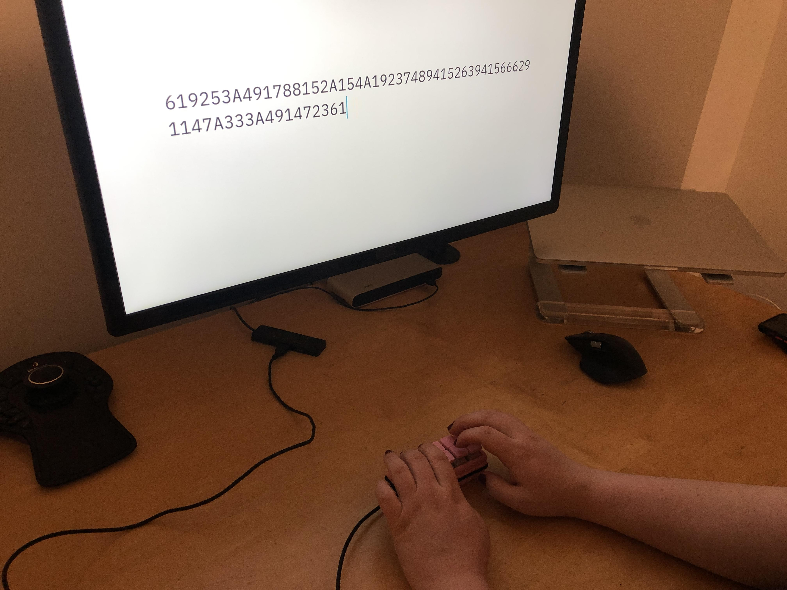

# Cozy Pad
*A cozy and wholesome macro pad for design folk*

Made by Sam Daitzman and Dieter Brehm


##  Goals

Our goal is to create and program a tiny macro-focused keyboard to make frequent tasks or shortcuts easier to access on a computer. It will have ten keys in a 5 column,  2 row grid, and will connect over usb to a computer. The computer will dictate the key-binding through its operating system, but the keypad firmware will bridge the gap between the key switches and the computer's USB keyboard spec.


## Learning Goals

### Sam
I want to learn more about USB communications and how embedded C interacts with d
peripherals. I'm particularly interested in understanding the connections
between the C code scanning for keypresses, and how to optimize the hardware
(in this case, probably a diode-switch matrix) to work well with the software
(which will probably need to scan the matrix very quickly). I'm excited to think
intentionally about how to write C that performs as well as possible with the
hardware we're working with. Over the course of the project, I also became more interested in learning about good API design for C code, especially data structures and polymorphism.

### Dieter

I want to learn more about C and C++ programming in embedded systems, and about
how to handle inter-peripheral communication and inter-computer communication.


## Resources

For our implementation, we learned a significant amount from the `Keypad.h` macropad/keypad library, authored by Mark Stanley and Alexander Brevig. The Keypad library provides a simple way to declare and track state in a keypad, and we significantly based our initial implementation on this library. Over the course of building out that implementation, we noted where we could improve over that library in API design and ease of use. One weakness of the `Keypad.h` library is that it relies on many different datastructures and methods, some of which have to be called correctly. This introduces a high degree of coupling between the code a developer implements with the library and the function bindings. We tried to improve on that by limiting ourselves to a few clearly defined and well-scoped API functions, and one core datastructure for tracking all aspects of the keypad's state. By combining multiple datastructures, we think we made our code much more clear.

For our remote cooperation, we relied on a flexible combination of multiple tools. We have both learned and implemented the PlatformIO toolchain for managing dependencies and running our builds and debug process. We did most of our work remotely using Visual Studio Code, though Dieter did some editing in emacs. We had some initial technical issues with Visual Studio Code live session sharing, but were able to resolve them. The only major downsides we found were that it was sometimes difficult to keep track across video tools and VS Code live share, and that all development and commits had to take place on Dieter's laptop (connected to our physical keypad device).


## What We've Done

So far, we've manufactured the electronics and mechanics of the device, and
we've built a simple demo program which fulfills the MVP we sought to make.



We've also started planning out some different, more advanced forms of input. Before we move on, we need to improve our current matrix scanning implementation and add some functionality. As an MVP, we used a USB communication library to program the keyboard to send a character or a phrase when a particular button is pressed. This was already functionally useful, especially when programmed with common phrases, as the firmware is already capable of interfacing with any USB
port and the keyboard can be programmed with whatever macros its user would find most helpful.

Beyond that basic implementation, we were able to write a well-scoped keypad implementation that scans the diode matrix for changes and tracks them in a well-specified data structure. We also include code that allows for specific methods (functional "event handlers") to be attached to different keypresses, and allow for simple traditional handling with one character assigned to each key. We support key-repeat properly, and implemented *n-key rollover*, which means that the keyboard can track an arbitrary number of keypresses (limited only by its memory) and send them as desired from a buffer. This is useful because it means that the code we implemented can be scaled to more complex, full keyboards or arbitrary dimensions, combining basic functionality like a normal keyboard with more advanced macropad operations.

### Keypad Configuration

```C++
int rowPins[ROWS] = {21, 20, 17, 19, 18};
  int colPins[COLS] = {0,1};
  char assignments[ROWS][COLS] = {
		{'1', '2'},
		{'3', '4'},
		{'5', '6'},
		{'7', '8'},
		{'9', '0'}
	};
```
*Above: Sample header code for declaring board pinout bindings in [firmware/src/keyboardcontroller.hpp](../firmware/src/keyboardcontroller.hpp)*
We included configuration header files in our library that an implementer can edit as desired to make the library adapt to their own layout. By making this modular and adopting a single point of declaration, we don't bind the library to any specific hardware and make it easier to make future changes to the structure of the matrix scan. This is especially important for customizing a keypad, where I/O is crucial and may be limited.

While this section would typically include output from our program, that output is absent here because our program's output takes place over a USB HID connection.

## API Design
We carefully designed our code as a C++ library to allow for as much implementation flexibility as useful, while including sane defaults for a generic keypad.

### C vs. C++ Polymorphism
We initially intended to implement our keypad classes using a system of C `Void*` pointers and nested function calls. As we designed this system, we realized that it was needlessly complex as we were basically reimplementing C++ classes by ourselves. Once we learned more about polymorphism and function-passing/class inheritance in C++, we decided to switch things over to native C++ features. This dramatically shortened our code, made our header-source separation more clear, and was a valuable learning experience in expanding our language knowledge.

### Library Structure
Our library is split into several components. Beginning at the user-visible main code and following references down to our lowest level:

1. The library is included in an existing program designed for an Arduino.h-compatible AVR chip or similar. In our case, we implement using a Teensy to show that Arduino-compatibles will work as well. The library is imported as `#include "keyboardcontroller.hpp"`.
2. The implementer introduces a new `KeyboardController` instance, named cozypad in our demo code, and calls its method `boardLoop` regularly during free time to run matrix scanning and send keycodes.
3. [`keyboardcontroller.hpp`](../firmware/src/keyboardcontroller.hpp) declares the basic keyboard implementation details such as pin/row/column arrangements, and declares a `KeyMatrix` instance we call `MasterMatrix`, with the necessary looping code.
4. The [`keymatrix.hpp`](../firmware/src/keymatrix.hpp) header file includes matrix scanning configuration code, such as debounce and key hold timing. This is another implementer-customizable header that can be used to configure the keyboard as desired.
5. The [`keymatrix.cpp`](../firmware/src/keyboardcontroller.cpp) source file is the core of our matrix scanning strategy, and respects a single shared datastructure  (mentioned below) across all operations.
	- The `updateEntries` method of the `KeyMatrix` class scans the physical key/diode matrix and updates key values in the data structure
	- The `sendEntries` method of the `KeyMatrix` class reads all key states and sends the desired characters. Still to be implemented is a check that supports arbitrary function handlers for each key, for more advanced keypress functionality/
	- The `operate` method of the `KeyMatrix` class performs one loop iteration of all operations necessary to scan the keyboard diode matrix and sent the appropriate keycodes over USB HID to the computer.
6. Upon initialization, the `KeyMatrix` class contains a 2x2 matrix of `KeySwitch` class instances from the [`keyswitch.cpp`](../firmware/src/keyswitch.cpp) and [`keyswitch.hpp`](../firmware/src/keyswitch.cpp) header files.
7. The `KeySwitch` class allows for specific operations or key values to be directly bound to it. Currently implemented is support for direct character binding, like how most traditional keyboards work. The class also contains a `KeyState` struct, which tracks the state of the button for near-future reference. Because all of the keys are scanned in each matrix scan and each key stores this data, our code can natively support n-key rollover.
8. The `KeyState` struct tracks whether each key is in `IDLE`, `PRESSED`, `HOLD` or `RELEASED` state.

### n-key Rollover Keypress Data Structure
In the keypad implementations we examined, we found that most relied on a shared fixed coordinate system for all data, often using a collection of many two-dimensional arrays. These structures necessitate passing keyboard dimensions all around, and make it very difficult to program dynamic functionality like changes of layer without functionally reimplementing the entire keypad datastructure and update code (which defeats the purpose of those libraries).

To avoid these pitfalls, we chose to rely on a single standard datastructure that embeds multiple smaller proto-structures that each represent the state and settings for each individual key. This approach enables a more flexible approach to building software that relies on our code, because there's only one datastructure to parse and only a few functions built in. It simplifies the most common assignment for a key (a single character) while preserving the ability to add custom implementations for a subset of keys. While we still need to implement function handling, the data structure exists that will support this functionality.

## Important Code Samples
Here are a few core examples of how our implementation allows for flexible development of a keypad like ours.

### Matrix Scanning Code
```C++
void KeyMatrix::updateEntries() {
	if (( millis() - lastCheck) > debounceT) {
		for (int r=0; r < ROWS; r++) {
			// only look at first column of matrix for row pins
			// set row as pullup resistor mode
			int pin = matrix[r][0].coords[0];
			pinMode(pin, INPUT_PULLUP);
		}

		for (int c=0; c < COLS; c++) {
			int cPin = matrix[0][c].coords[1];
			pinMode(cPin, OUTPUT);
			// begin column pulse
			digitalWrite(cPin, LOW);
			// for all rows
			for (int r=0; r < ROWS; r++) {
				...
				→ scans row and stores values
				...
			}

			//end column pulse
			digitalWrite(cPin, HIGH);
			pinMode(cPin, INPUT);
		}

		lastCheck = millis();
	}
}
```

The above code (with row scanning implementation details omitted for brevity) looks over each row and column of the matrix efficiently, sending row and column pulses to address individual keyswitches one at a time, and stores readings in a reusable `KeyMatrix` class datastructure that the rest of the library is built around. By separating this from the actual USB sending implementation, we allow the library consumer to implement their own output for different hardware, or use the keypad values entirely differently than how we would. An important detail here is that the `KeyMatrix` datastructure contains all information necessary to implement the matrix scanner, including pinout and a unified coordinate system for all information the scanner needs to store.

### Keypress Data Structure Implementation
```C++
KeyMatrix::KeyMatrix(char assignments[ROWS][COLS], int rowPins[ROWS], int colPins[COLS]){
	// initalize the coordinate values of the keymatrix
	for (int i = 0; i < ROWS; i++) {
		for (int j = 0; j < COLS; j++) {
			int coord[2] = {rowPins[i], colPins[j]};
			KeySwitch key = KeySwitch(assignments[i][j], coord);
			matrix[i][j] = key;
		}
	}
}
```
The `KeyMatrix` datastructure initializer fills in key assignments and pin coordinates inline across all keys, and these values are used in regular operation of the keyboard once they are stored. Because this implementation centralizes each key's configuration and state in a single state machine, code that consumes that configuration and state can behave (and be debugged) predictably. Here, we are parsing the keyboard setup passed from configuration header files and initializing the `KeyMatrix` datastructure.

## Project Outcomes

In spite of the jarring transition to digital Olin and the ongoing circumstances affecting Sam, we finished all of our minimum goals for success early in the project and set up a foundation for continuing work after the deadline to complete our stretch goals. We learned more about good C++ library design, challenged our initial assumptions about how to represent keyboard state, and met our learning goals.

If we had more time, we would implement direct bytecode entry, built-in layer-switching for multiple keyboard input modes, and we would finish implementing arbitrary keyswitch function handling to remove boilerplate code for making advanced keyboard customizations. After the conclusion of this Software Systems project, we're planning to continue work to implement those features.

Sam achieved her learning goals of learning more about USB communications and embedded C peripheral interactions, and creating delightful C++ libraries with dependable data structures and non-confusing polymorphism. She learned a lot from helping design a dependable struct-based datastructure for supporting more advanced keyboard configurations and states, and especially from realizing there were better approaches to use (like C++ classes).

Dieter achieved his learning goals of learning more about C/C++ programming in embedded systems, and how to handle inter-peripheral and -computer communication. Specifically, he implemented the key repeat code that handles USB HID key sending based on the contents of the matrix, and read more about how the libraries we depend on implement lower-level operations like USB protocol communications.


[GitHub Repository](https://github.com/Inkering/CozyPad) // 
[Trello Board](https://trello.com/b/XE28EbTX/cozypad)

