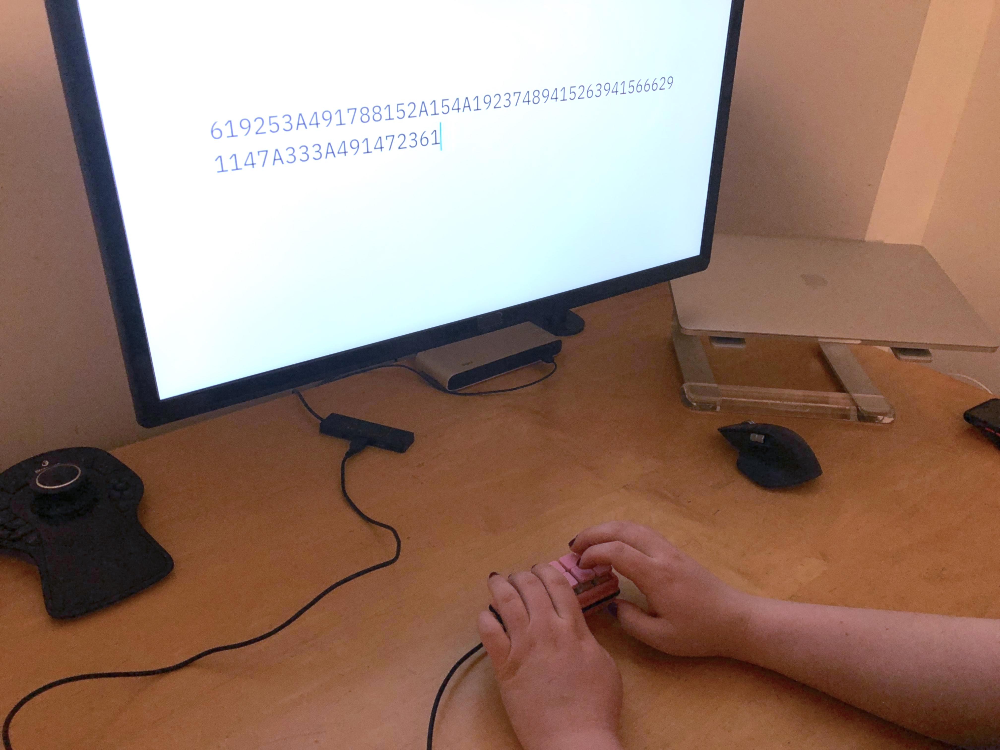

# Cozy Pad
*A cozy and wholesome macro pad for design folk*

Made by Sam Daitzman and Dieter Brehm

##  Goals

Our goal is to create and program a tiny macro-focused keyboard to make frequent tasks or
shortcuts easier to access on a computer. It will have ten keys in a 5 column, 
2 row grid, and will connect over usb to a computer. The computer will dictate
the key-binding through its operating system, but the keypad firmware will
bridge the gap between the key switches and the computer's USB keyboard spec.

## Minimum Interesting Results

* A physical keypad that connects over usb and allows the user to press buttons to type characters on a computer.
* Should work on windows, mac, and linux

## Maximum Interesting Results

* Write our own matrix parsing and keypress/timing data structures
* Support multiple layers of inputs
* Fancy case or rotary encoders on the macro pad
* Multiple control layers with a switch that activates them
* Robust ability to support different physical mechanism grid sizes (i.e.number of keys)
* Portable keyboard implementation library
* WiFi or Bluetooth pairing ability

## Learning Goals

### Sam
I want to learn more about USB communications and how embedded C interacts with
peripherals. I'm particularly interested in understanding the connections
between the C code scanning for keypresses, and how to optimize the hardware
(in this case, probably a diode-switch matrix) to work well with the software
(which will probably need to scan the matrix very quickly). I'm excited to think
intentionally about how to write C that performs as well as possible with the
hardware we're working with.

### Dieter

I want to learn more about C and C++ programming in embedded systems, and about
how to handle inter-peripheral communication and inter-computer communication.

## What We've Done

So far, we've manufactured the electronics and mechanics of the device, and
we've built a simple demo program which fulfills the MVP we sought to make.

## What's Next

The next step will be to improve our code quality, reach for some stretch goals, 
and to create additional control layers for the key pad.

### Sam's Next Steps

I'm going to work on designing a useful interface that allows the keyboard to
switch between different modes like byte entry, function keys, arrow keys,
numpad or similar. Depending on how much time is left in the project, I'll
implement one or more of these input modes.

### Dieter's Next Steps

I'm going to work on the efficiency of data structures and matrix scanning for
the cozypad, focused on optimizing debounce time, etc.

## What we did first

* Construct and wire up mvp macropad (1st week of project)
* Identify microcontroller of choice and locate documentation
* Sketch out an architecture for what control layers and functionality we want
* Research usb-keyboard protocols and communication
* Get a single button to write a single letter character on the computer
* Get a single button to write out a phrase, debounced to avoid repetitions

[GitHub Repository](https://github.com/Inkering/CozyPad)
[Trello Board](https://trello.com/b/XE28EbTX/cozypad)

